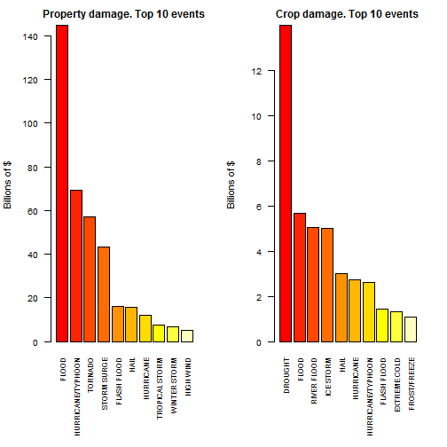

Most dangerous storm events for population and economy.
========================================================

## Synopsis

  In this report we will investigate the dataset [Storm Data]
(https://d396qusza40orc.cloudfront.net/repdata%2Fdata%2FStormData.csv.bz2) 
from NATIONAL WEATHER SERVICE.  
  The goal of our analysis is to find out what  type of events in Storm Data are 
 most harmful for people and for economy. Folowing this goal we will  examine 
 two questions:  
  1. Which types of events are most harmful with respect to population health?
  2. Which types of events have the greatest economic consequences?

Analysis will show to us that tornado is most dangerous "event" for people 
without any doubt.  
For economy we will see two different events for two different sides of economy.
Flood is most harmful for property, while the drought has critical consequences
for crop.

## Data Processing
  
### Loading Data
  
Our first step is download [Storm Data](https://d396qusza40orc.cloudfront.net/repdata%2Fdata%2FStormData.csv.bz2) from the Internet.    
 After that we will load dataset in several steps.
 * We read one row and define what features (columns) we need for our analysis.
 * Load only this limited  set of features. It's will save us computer memory and time.
 * Our dataset is compressed bz2 file. We will use "bzfile" function from 
 base package to read our data directly from the archive.


```r

# download data if not downloaded already
fn <- "data/repdata-data-StormData.csv.bz2"
if (!file.exists(fn)) {
    message("Downloading dataset.")
    download.file("https://d396qusza40orc.cloudfront.net/repdata%2Fdata%2FStormData.csv.bz2", 
        destfile = fn)
}

# read one row
fnbz <- bzfile(fn, "r")
data <- read.csv(fnbz, header = TRUE, nrows = 1)
close(fnbz)
```


We know from National Weather Service [Storm Data Documentation] (https://d396qusza40orc.cloudfront.net/repdata%2Fpeer2_doc%2Fpd01016005curr.pdf) we need only several features from dataset. They are:
 * EVTYPE  - Event type
 * FATALITIES - Event-related fatalities
 * INJURIES  - Event-related injuries
 * PROPDMG -  Property damage amount
 * PROPDMGEXP - Property damage units
 * CROPDMG - Crop damage amount
 * CROPDMGEXP - Crop damage units

where "damage units" are  "K" for thousands, "M" for millions, and "B" for billions.


```r

allNames <- names(data)

# limited features for analysis. names and indexes
featureNames <- c("EVTYPE", "FATALITIES", "INJURIES", "PROPDMG", "PROPDMGEXP", 
    "CROPDMG", "CROPDMGEXP")
featureInd <- sapply(featureNames, function(x) {
    which(allNames == x)
})

dcols <- rep("NULL", ncol(data))
dcols[featureInd] <- NA

# read limited set of features
fnbz <- bzfile(fn, "r")
data <- read.csv(fnbz, header = T, colClasses = dcols)
close(fnbz)
```

  
  
  
### Clearing Data  
  
  
At this point of analysis we have our data loaded. The only thing we need is 
to clearing our data.  
 We will:
 * Convert  events to uppercase.
 * Transform Property damage units and Crop damage units into numeric multipliers.
Our converting policy is simple. 
If damage unit is one of the "K"("k"), "M"("m"), "B"("b")
we will convert it to 1e+3, 1e+6, 1e+9 accordingly, otherwise we return zero


```r

# convert function. use with sapply
dnum <- data.frame(K = 1000, M = 1e+06, B = 1e+09)
fnum <- function(x) {
    if (x %in% c("K", "M", "B")) 
        dnum[1, x] else 0
}

data <- transform(data, EVTYPE = as.factor(toupper(EVTYPE)))
data <- transform(data, PROPDMGEXP = toupper(PROPDMGEXP), CROPDMGEXP = toupper(CROPDMGEXP))
data <- transform(data, PROPDMGEXP = sapply(PROPDMGEXP, fnum), CROPDMGEXP = sapply(CROPDMGEXP, 
    fnum))
```


The final step is to make some preparation to find answers to our questions 
quickly.

First, we will need to measure storm events impact to population.
We define two cross tables for this purpose. One for FATALITIES, one for INJURIES.


```r

tabF <- sort(xtabs(FATALITIES ~ EVTYPE, data = data), decreasing = T)
tabI <- sort(xtabs(INJURIES ~ EVTYPE, data = data), decreasing = T)
```


The same way we define cross tables to measure events impact to economy.
The only difference, we will need additionally multiply columns PROPDMG and PROPDMGEXP for property  losses and CROPDMG and CROPDMGEXP for crop losses. 


```r

tabP <- data.frame(EVTYPE = data$EVTYPE, PROPDMG = data$PROPDMG * data$PROPDMGEXP)
tabC <- data.frame(EVTYPE = data$EVTYPE, CROPDMG = data$CROPDMG * data$CROPDMGEXP)
tabP <- sort(xtabs(PROPDMG ~ EVTYPE, data = tabP), decreasing = T)
tabC <- sort(xtabs(CROPDMG ~ EVTYPE, data = tabC), decreasing = T)
```


 At this point of analysis we ready to present results.
   
  
     
##  Results


### Most harmful events for Population.

Our first question was about types of events which
are most harmful with respect to population health.

The most influential ten events for FATALITIES are:  
  

```r
data.frame(TYPE_EVENT = names(tabF[1:10]), Fatalities = tabF[1:10], row.names = 1:10)
```

```
##        TYPE_EVENT Fatalities
## 1         TORNADO       5633
## 2  EXCESSIVE HEAT       1903
## 3     FLASH FLOOD        978
## 4            HEAT        937
## 5       LIGHTNING        816
## 6       TSTM WIND        504
## 7           FLOOD        470
## 8     RIP CURRENT        368
## 9       HIGH WIND        248
## 10      AVALANCHE        224
```


The most influential ten events for INJURIES are:  
  

```r
data.frame(TYPE_EVENT = names(tabI[1:10]), Injuries = tabI[1:10], row.names = 1:10)
```

```
##           TYPE_EVENT Injuries
## 1            TORNADO    91346
## 2          TSTM WIND     6957
## 3              FLOOD     6789
## 4     EXCESSIVE HEAT     6525
## 5          LIGHTNING     5230
## 6               HEAT     2100
## 7          ICE STORM     1975
## 8        FLASH FLOOD     1777
## 9  THUNDERSTORM WIND     1488
## 10              HAIL     1361
```


We can illustrate this results in the following graphic.   

  

```r
par(mfrow = c(1, 2))
par(mar = c(8, 4, 2, 2))
barplot(tabF[1:10]/1000, col = heat.colors(10, alpha = 1), las = 2, cex.names = 0.7, 
    cex.main = 1, cex.lab = 0.9, cex.axis = 0.8, ylab = "Amount of people (in  thousands)", 
    main = "Fatalities. Top 10 events")
barplot(tabI[1:10]/1000, col = heat.colors(10, alpha = 1), las = 2, cex.names = 0.7, 
    cex.main = 1, cex.lab = 0.9, cex.axis = 0.8, ylab = "Amount of people (in  thousands)", 
    main = "Injures. Top 10 events")
```

 

  
Graphics show us the most dangerous
top 10 storm event responsible for Injures and Fatalities among people.   
      
     
### Most dangerous events for Economy.
  
Our second question was about types of events 
are most harmful for economy.

The most influential ten events for Property damage are:  


```r
data.frame(TYPE_EVENT = names(tabP[1:10]), Property_damage = tabP[1:10], row.names = 1:10)
```

```
##           TYPE_EVENT Property_damage
## 1              FLOOD       1.447e+11
## 2  HURRICANE/TYPHOON       6.931e+10
## 3            TORNADO       5.694e+10
## 4        STORM SURGE       4.332e+10
## 5        FLASH FLOOD       1.614e+10
## 6               HAIL       1.573e+10
## 7          HURRICANE       1.187e+10
## 8     TROPICAL STORM       7.704e+09
## 9       WINTER STORM       6.688e+09
## 10         HIGH WIND       5.270e+09
```


The most influential ten events for Crop damage are:    


```r
data.frame(TYPE_EVENT = names(tabC[1:10]), Crop_damage = tabC[1:10], row.names = 1:10)
```

```
##           TYPE_EVENT Crop_damage
## 1            DROUGHT   1.397e+10
## 2              FLOOD   5.662e+09
## 3        RIVER FLOOD   5.029e+09
## 4          ICE STORM   5.022e+09
## 5               HAIL   3.026e+09
## 6          HURRICANE   2.742e+09
## 7  HURRICANE/TYPHOON   2.608e+09
## 8        FLASH FLOOD   1.421e+09
## 9       EXTREME COLD   1.313e+09
## 10      FROST/FREEZE   1.094e+09
```


We can illustrate this results in the graphic bellow.   


```r
par(mfrow = c(1, 2))
par(mar = c(8, 4, 2, 2))
barplot(tabP[1:10]/1e+09, col = heat.colors(10, alpha = 1), las = 2, cex.names = 0.7, 
    cex.main = 1, cex.lab = 0.9, cex.axis = 0.8, ylab = "Billions of $", main = "Property damage. Top 10 events")

barplot(tabC[1:10]/1e+09, col = heat.colors(10, alpha = 1), las = 2, cex.names = 0.7, 
    cex.main = 1, cex.lab = 0.9, cex.axis = 0.8, ylab = "Billions of $", main = "Crop damage. Top 10 events")
```

 

  
Graphics show us the most influential 
top 10 storm event responsible for greatest finance losses in property and
crop economy.    
      
      
## Conclusion

 The most harmful events for Population and for economy are differ.  
 For people tornado is most dangerous event with huge  advantage over other events.  
 For economy it's a little bit "complicated". We have difernt most harmful events for property and for crop which are the most harmful. Floods make the lagest damage for  
 property while drough are most dangerous for crop.

